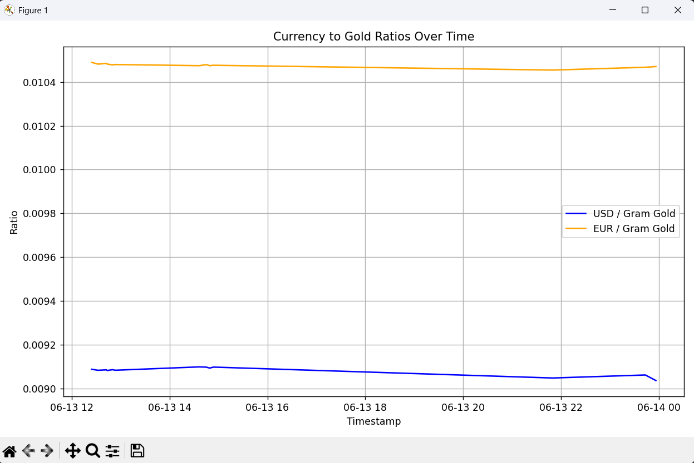
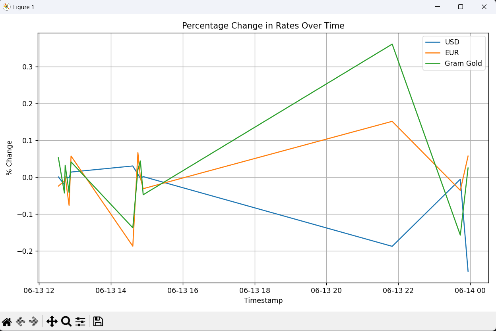
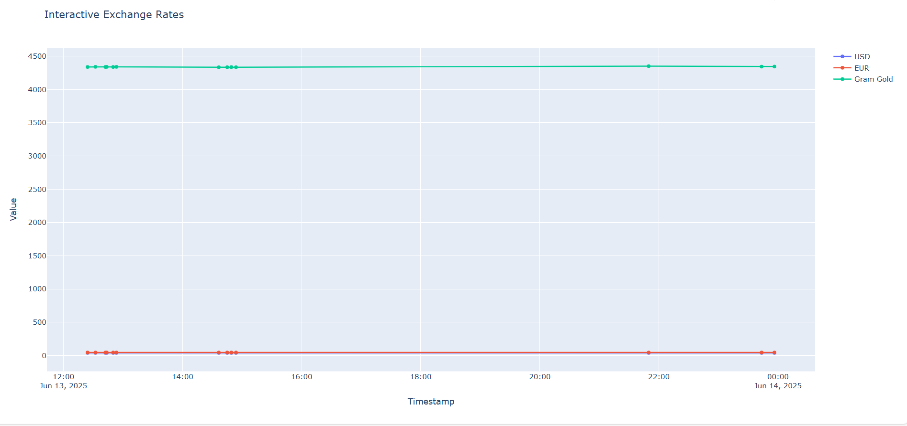

## 📊 Currency & Gold Analysis Tool

This project fetches daily exchange and gold rates, stores them locally, and visualizes them through various static and interactive charts. It allows the user to filter data by date and view statistical insights such as the highest and lowest rates.

---

### 🚀 Features

* 🕐 **Fetches daily exchange & gold prices**
* 📁 **Stores data as CSV**
* 📅 **Filters by custom date range**
* 📈 **Includes 4 chart types:**

  * Exchange rate over time
  * Currency / Gold ratio
  * Percentage change
  * Interactive (Plotly) chart
* 🧠 **Shows highest and lowest value dates**
* 🎨 **Colorful and intuitive terminal menu**

---

### 🖼️ Example Charts

#### 📉 Exchange Rate Chart


#### ⚖️ USD / Gram Gold Ratio



#### 📉 Percentage Change



#### 🧭 Interactive Plot (Plotly)




---

### 🛠️ Installation

```bash
git clone https://github.com/Selinoztrk/project-name.git
cd project-name
pip install -r requirements.txt
python main.py
```

---

### 🧹 Requirements

* Python 3.9+
* `pandas`
* `matplotlib`
* `plotly`
* `requests`
* `colorama`

---

### 📂 Project Structure

```
project-name/
├── analyzer.py         # Analysis & chart functions
├── main.py             # Main CLI app
├── scraper.py          # Scrapes exchange rate data
├── storage.py          # Saves data to CSV
├── data/
│   └── exchange_rates.csv
├── screenshots/
│   ├── exchange_rates.png
│   ├── currency_to_gold.png
│   ├── percentage_change.png
│   ├── interactive.png
    └── terminal1.png
└── README.md
```

---

### 📋 How to Use

Upon running the program:

1. Latest data is fetched from the internet
2. Data is saved into a local CSV
3. Optional date range input is requested
4. User selects which charts/analysis to view from a terminal menu

---

### 📌 Notes

* Date format: `YYYY-MM-DD`
* Interactive chart opens in your default web browser.

---

### 📸 Terminal Preview

```text
[1] Exchange Rate Chart
[2] USD/EUR to Gram Gold Ratio
[3] Percentage Change
[4] Interactive Chart (Plotly)
[5] Show Date Range Again
[6] Export Filtered Data to CSV
[7] Show Summary (High/Low/Change %)
[0] Exit
```

---

### 👩‍💻 Developer

**Selin Öztürk**
🔗 GitHub: [github.com/Selinoztrk](https://github.com/Selinoztrk)
